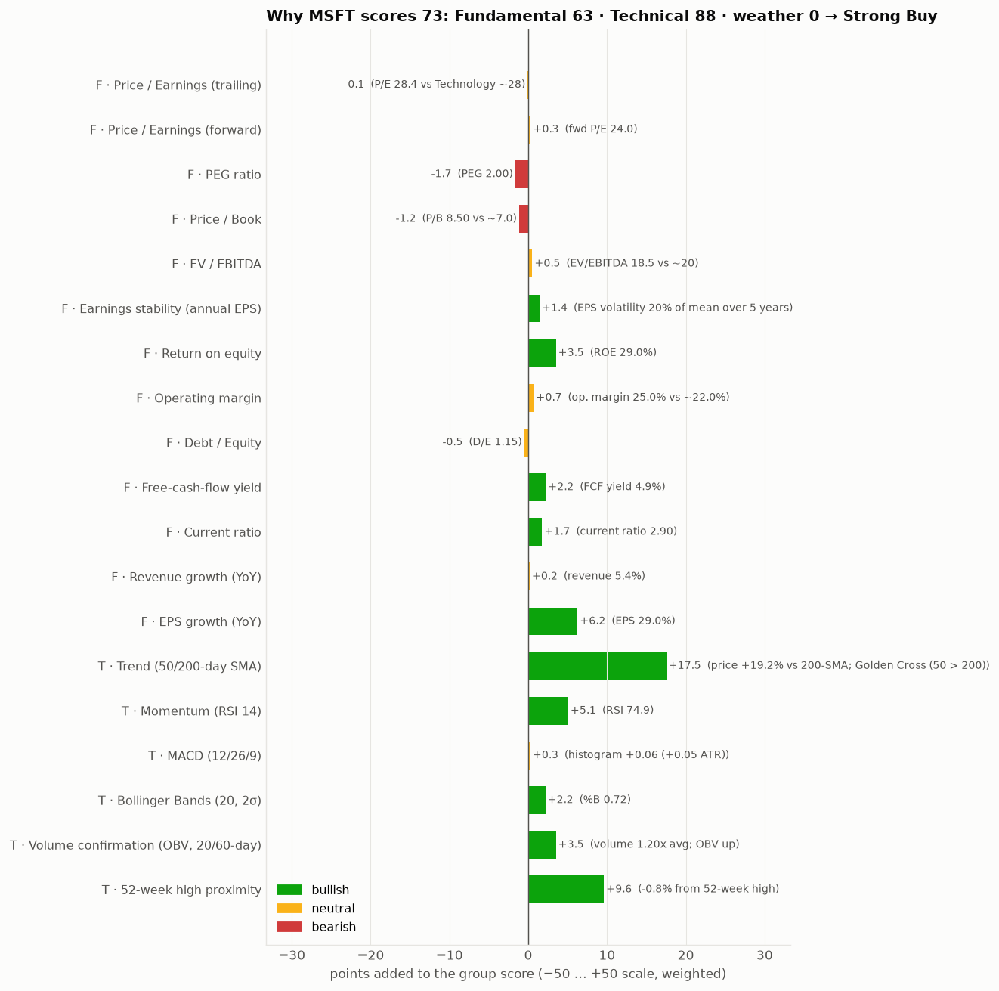
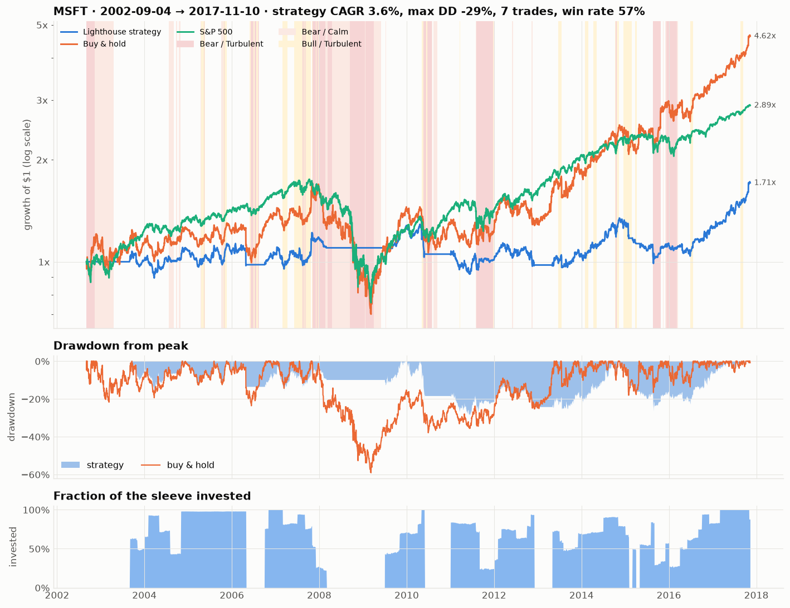

# 🔦 Lighthouse — explainable stock decisions for self-directed investors

*A clear signal in a noisy market.*

Lighthouse turns a ticker and four facts about **you** — horizon, risk tolerance, the most you accept losing on one
position, portfolio size — into a **Buy / Hold / Sell verdict, a position plan (shares, exit level, worst-case loss)
and the reasons behind it**, then shows honestly how the rule behind that verdict would have behaved in the past.

[](https://colab.research.google.com/github/lotainc0/Stock-Trader-FINTECH-Project/blob/claude/compassionate-lamport-5gd8yf/notebooks/Lighthouse.ipynb)


| Why does MSFT score 73? | How did the rule behave? |
|---|---|
|  |  |

## What it does

1. **Collects and cleans** daily prices & volume, the S&P 500 and fundamentals (Yahoo Finance → Stooq → cache → bundled real sample data, so it always runs).
2. **Fundamental analysis** — 13 beacons (P/E, forward P/E, PEG, P/B, EV/EBITDA, earnings stability, ROE, margin, debt/equity, FCF yield, current ratio, revenue & EPS growth) scored against sector norms.
3. **Technical analysis** — 6 beacons: trend (50/200-day SMA, Golden/Death Cross), RSI, MACD, Bollinger %B, volume confirmation (OBV), 52-week-high proximity.
4. **Market weather** — Bull/Bear × Calm/Turbulent regime of the S&P 500 that penalises scores, raises the entry bar and halves sizes in bear markets.
5. **Decision** — horizon-weighted composite → verdict → position size from the *smallest* of three rules (your max-loss limit, a volatility target, a concentration cap).
6. **Honest evaluation** — point-in-time backtest vs buy-and-hold and the S&P 500, layer attribution, sensitivity grid, walk-forward out-of-sample test, regime breakdown.
7. **Watchlist ranking**, plain-English **report**, Streamlit **app**, **CLI**.

## Quick start

```bash
pip install -r requirements.txt
python -m lighthouse analyze MSFT --horizon long --risk balanced --max-loss 2 --portfolio 25000 --out reports/MSFT --evaluate
python -m lighthouse screen AAPL MSFT NVDA JPM XOM UNH
streamlit run app.py            # point-and-click app
python -m pytest                # 36 tests, runs offline
```

```python
from lighthouse import analyze, InvestorProfile
r = analyze("MSFT", InvestorProfile(horizon="long", risk="balanced", max_loss_pct=2, portfolio_value=25_000))
print(r.decision.headline())     # MSFT: STRONG BUY (Lighthouse score 73/100) for a long-term, balanced investor
print(r.report())                # the full plain-English report
r.backtest.summary()             # strategy vs buy & hold vs S&P 500
```

No internet? Set `LIGHTHOUSE_OFFLINE=1` (or `--source sample`): the bundled pack holds real Microsoft OHLCV 1986-2017, 19 other S&P 500 stocks and the index to 2022.

## Results in one table

Long-horizon rule, balanced profile, 20 S&P 500 stocks, Dec 1990 – Dec 2022, 10 bps costs per side, next-day fills
(`reports/examples/cross_ticker_evaluation.csv`):

| | CAGR | Volatility | Sharpe | Max drawdown |
|---|---|---|---|---|
| Buy & hold | 13.3% | 33.5% | 0.50 | −69% |
| Lighthouse signals + regime (fully invested when in) | 10.1% | — | 0.44 | −58% |
| **Lighthouse balanced (vol-targeted)** | 6.4% | 12.7% | 0.39 | **−32%** |
| Lighthouse conservative | 4.6% | 8.8% | 0.32 | −23% |

Lower drawdown and volatility in **20 of 20** stocks; higher Sharpe than buy-and-hold in 4 of 20. We say the second
part out loud: single-stock timing does not out-return relentless compounders, it delivers the risk profile you asked
for. See `docs/METHODOLOGY.md` for every choice and the experiments we rejected.

## Repository map

```
lighthouse/            the product (pure Python, pandas/numpy/matplotlib)
  config.py            investor profiles, strategy parameters, verdict bands  <- all the numbers to defend
  data.py              live/offline data loading, cleaning report, fundamentals parsing, caching
  indicators.py        causal SMA/EMA/RSI/MACD/Bollinger/ATR/OBV/volatility/drawdown
  technicals.py        technical beacons and score
  fundamentals.py      fundamental beacons, sector norms, point-in-time scores
  regime.py            market weather
  decision.py          composite score, verdict, exit level, position sizing
  backtest.py          point-in-time engine, metrics, layers, sensitivity, walk-forward, regime breakdown
  engine.py            analyze() pipeline and AnalysisResult
  screener.py          watchlist ranking
  report.py            Markdown report
  charts.py            all charts
  __main__.py          CLI
app.py                 Streamlit app
notebooks/Lighthouse.ipynb   end-to-end Colab/Jupyter deliverable (built by scripts/build_notebook.py)
data/sample/           bundled real historical data + an offline fundamentals fixture
reports/examples/      example report, charts and the cross-ticker evaluation
docs/                  EXECUTIVE_SUMMARY.md · METHODOLOGY.md · PITCH.md · USER_GUIDE.md
tests/                 36 pytest tests (indicators, scoring, sizing, no-look-ahead, pipeline)
```

## Limitations

Sector norms are assumptions, not live peer data; Yahoo supplies only ~5 years of statements; the backtest ignores
taxes and checks stops at the close; the evaluation universe is survivorship-biased. Lighthouse is decision support,
not investment advice.

MIT licensed.
